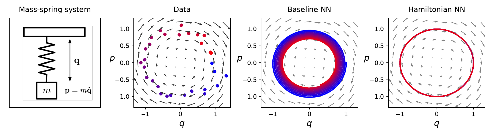
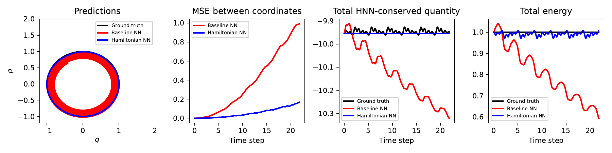

# Spring 实验复现报告

## 1. 实验概述

本报告复现 Hamiltonian Neural Networks 仓库中的 `spring` 实验。

实验目标包括：

1. 训练 ideal mass-spring system 上的 baseline neural network 与 HNN。
2. 重新执行仓库自带的 `analyze-spring.ipynb`。
3. 将复现实验结果与 `README.md` 中给出的参考指标进行对比。
4. 保存图像结果，并给出结论分析。

## 2. 复现实验流程

### 2.1 模型训练

本次实验直接使用仓库默认训练脚本：

```bash
PYTHONPATH=/tmp/hnn-deps python3 experiment-spring/train.py --verbose
PYTHONPATH=/tmp/hnn-deps python3 experiment-spring/train.py --baseline --verbose
```

训练结束后得到两个权重文件：

- `experiment-spring/spring-hnn.tar`
- `experiment-spring/spring-baseline.tar`

这两个 `.tar` 文件本质上是 PyTorch 保存的模型参数，即 `state_dict`。

### 2.2 Notebook 分析

随后直接执行仓库中的：

- `analyze-spring.ipynb`

Notebook 会加载上述两个权重文件，并生成分析图像，保存到：

- `figures/spring.pdf`
- `figures/spring-integration.pdf`

为了便于在 Markdown 报告中直接展示，又额外生成了 PNG 版本：

- `reports/spring-assets/spring.png`
- `reports/spring-assets/spring-integration.png`

## 3. 指标对比

下表中参考值来自仓库 `README.md`。

| 指标 | 模型 | 本次复现结果 | README 参考值 |
| --- | --- | ---: | ---: |
| 训练损失 | Baseline NN | `3.7099e-02 +/- 1.9133e-03` | `3.7134e-02 +/- 1.9143e-03` |
| 训练损失 | HNN | `3.6928e-02 +/- 1.9128e-03` | `3.6933e-02 +/- 1.9128e-03` |
| 测试损失 | Baseline NN | `3.6585e-02 +/- 1.8572e-03` | `3.6656e-02 +/- 1.8652e-03` |
| 测试损失 | HNN | `3.5916e-02 +/- 1.8302e-03` | `3.5928e-02 +/- 1.8328e-03` |
| 能量 MSE | Baseline NN | `1.6800e-01 +/- 2.06e-02` | `1.7077e-01 +/- 2.06e-02` |
| 能量 MSE | HNN | `3.7659e-04 +/- 7.90e-05` | `3.8416e-04 +/- 6.53e-05` |

## 4. 图像结果

### 4.1 向量场与相轨迹对比



这张图展示了：

- 真实的 mass-spring 数据分布
- baseline NN 学到的向量场
- HNN 学到的向量场

### 4.2 长时间积分与能量守恒对比



这张图展示了：

- 相空间中的长时间轨迹预测
- 坐标误差 MSE 随时间的变化
- HNN 学到的守恒量
- 真实总能量随时间的变化

## 5. 结果分析

### 5.1 与参考结果的一致性

- 本次复现得到的训练损失和测试损失与 README 中的参考值非常接近。
- 能量 MSE 的结果也与参考值高度一致。
- 说明 `spring` 实验已经被成功复现，训练流程和 notebook 分析流程都是正确的。

### 5.2 物理意义上的差异

- Baseline NN 和 HNN 在局部导数拟合上差距并不大，train/test loss 数值接近。
- 但在长时间积分时，baseline NN 的能量误差明显更大。
- HNN 在能量守恒上的表现明显更稳定，这正是模型结构先验带来的优势。

换句话说：

- Baseline NN 可以学到“局部上看起来对”的动力学。
- HNN 除了学到局部导数，还更好地保留了系统的哈密顿结构。
- 因此 HNN 在长时间预测时更不容易漂移，更符合真实物理系统行为。

## 6. 最终结论

`spring` 实验已经成功复现，主要结论如下：

1. 本次复现得到的数值指标与仓库给出的参考结果高度一致。
2. HNN 与 baseline 在点对点导数拟合上的差距不大。
3. HNN 在长时间积分和能量守恒方面显著优于 baseline。
4. 该结果支持仓库和论文中的核心观点：在动力系统建模中，引入 Hamiltonian 结构先验能够显著改善模型的物理一致性。
